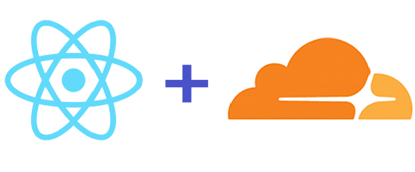

# React + Cloudflare workshop

- [Cloudflare edge server](https://www.cloudflare.com/learning/cdn/glossary/edge-server/)
- [Cloudflare Workers](https://workers.cloudflare.com/)
- [Wrangler](https://developers.cloudflare.com/workers/tutorials/deploy-a-react-app-with-create-react-app/)

This project was bootstrapped with [React Mui Boilerplate](https://github.com/rosealexander/react-mui-boilerplate).

### Available Scripts

In the project directory, you can run:

### `npm start`

Runs the app in the development mode.\
Open [http://localhost:3000](http://localhost:3000) to view it in your browser.

The page will reload when you make changes.\
You may also see any lint errors in the console.

### `npm run build`

Builds the app for production to the `build` folder.\
It correctly bundles React in production mode and optimizes the build for the best performance.

See the section about [deployment](https://facebook.github.io/create-react-app/docs/deployment) for more information.

### `wrangler dev`
Establishes a connection between localhost and an edge server that operates your Worker
in development. All requests are forwarded to the edge server, which continuously updates as your Worker
code changes. \
Open [http://127.0.0.1:8787](http://127.0.0.1:8787) to view in your browser.

### `wrangler publish`
Uses bucket and entry-point from `wrangler.toml` to deploy site to Workers.

## Learn More

Checkout the [Cloudflare Workers](https://developers.cloudflare.com/workers/) documentation to learn more about
Cloudflare's serverless execution environment.

You can learn more in the [Create React App documentation](https://facebook.github.io/create-react-app/docs/getting-started).

To learn React, check out the [React documentation](https://reactjs.org/).

Take a look at the [Material Design Framework](https://material.io/design/introduction) and get started using the
[Material UI component library](https://mui.com).
